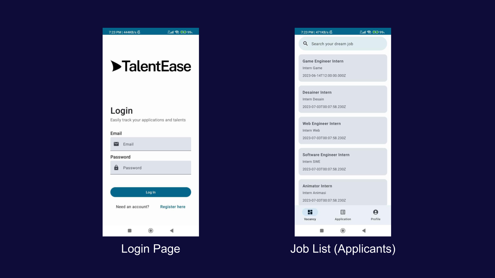
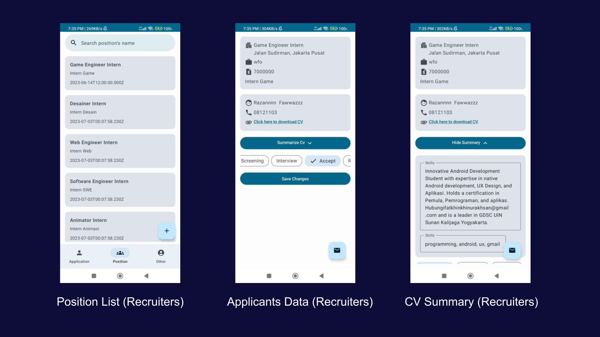

# TalentEase Mobile Application

TalentEase Mobile Application serves as **Applicant Tracking System (ATS)** that helps companies to manage their hiring process. TalentEase streamlines the hiring process by providing all standard functionalities found in conventional tracking systems for monitoring job applications or career pages. This includes features such as **job posting**, **applicant tracking**, and **resume parsing**.

[Download full source code and apk here](https://github.com/talentease/mobile/releases/tag/v.1.0.0)
## Tech Stack
- Kotlin
- [Androidx Library](https://developer.android.com/jetpack?hl=id)
- [Jetpack Compose](https://developer.android.com/jetpack/compose)
- [Retrofit](https://square.github.io/retrofit/)
- [Material Design 3](https://m3.material.io/)
## Features
- List Job
- Apply Job
- Edit Profile
- Track Application
- Create New Job
- Edit Job
- Update Application Status
- CV Summarize
## App Preview

